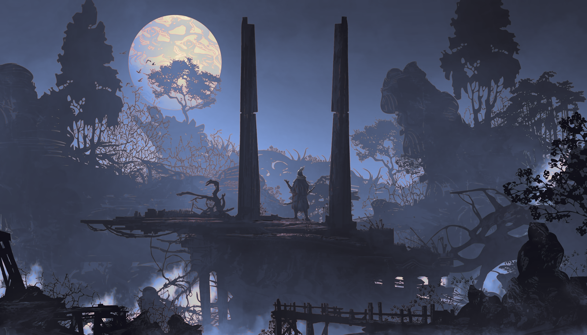
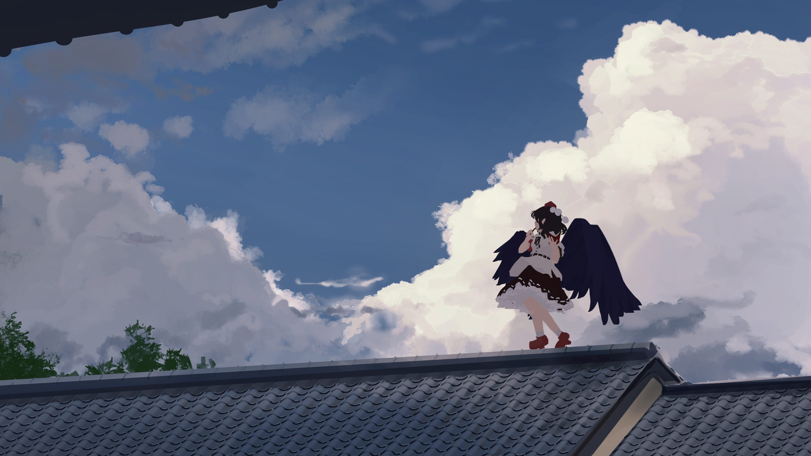
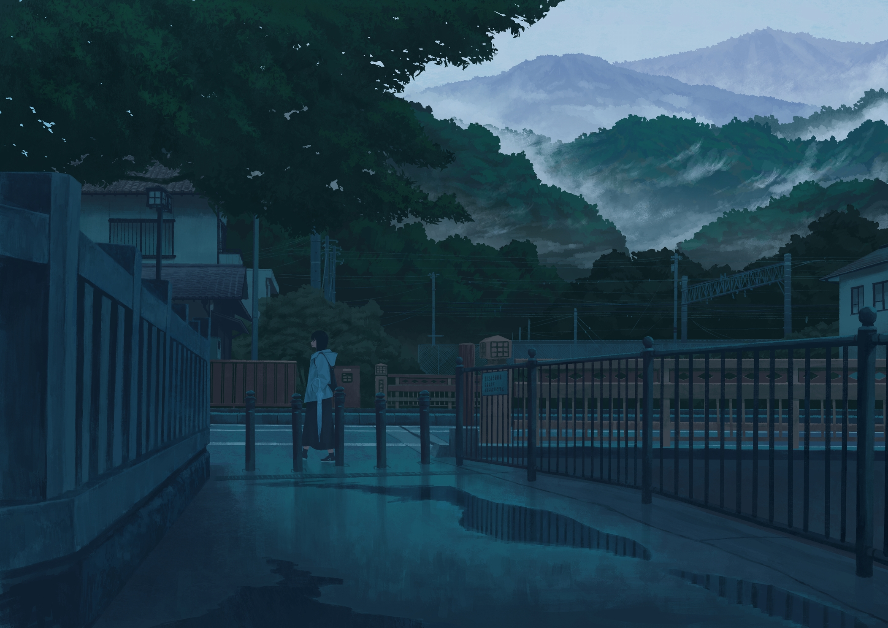
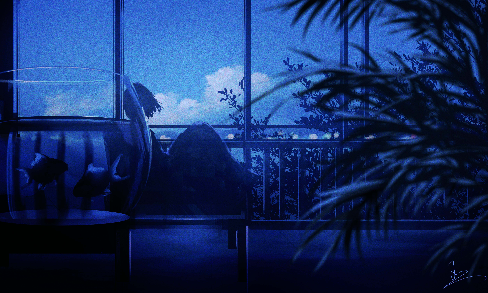
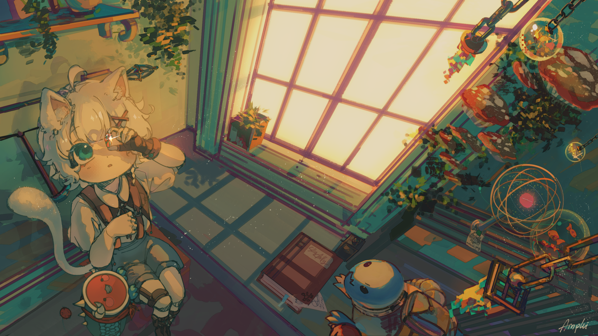
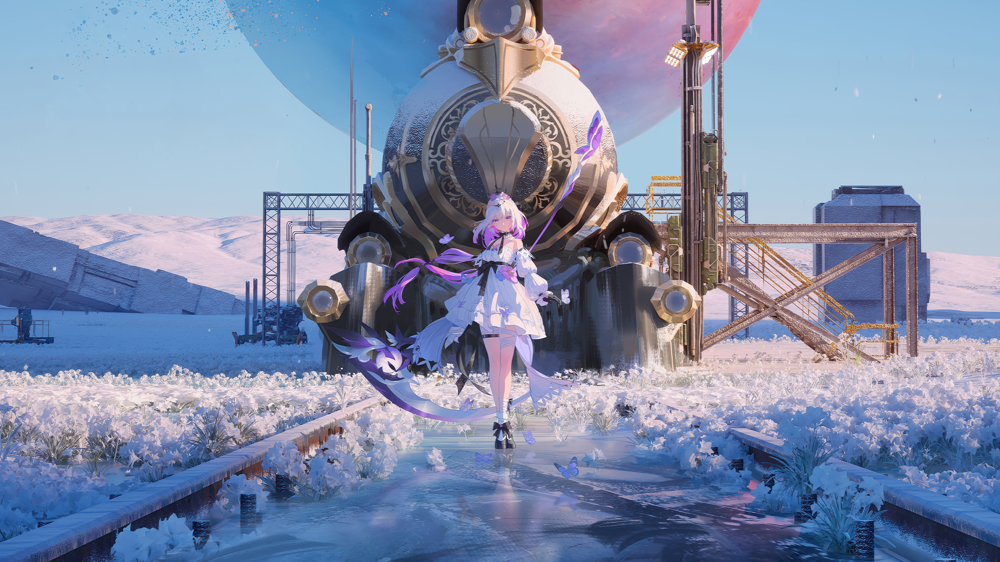
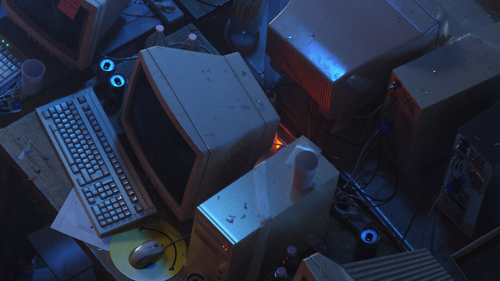
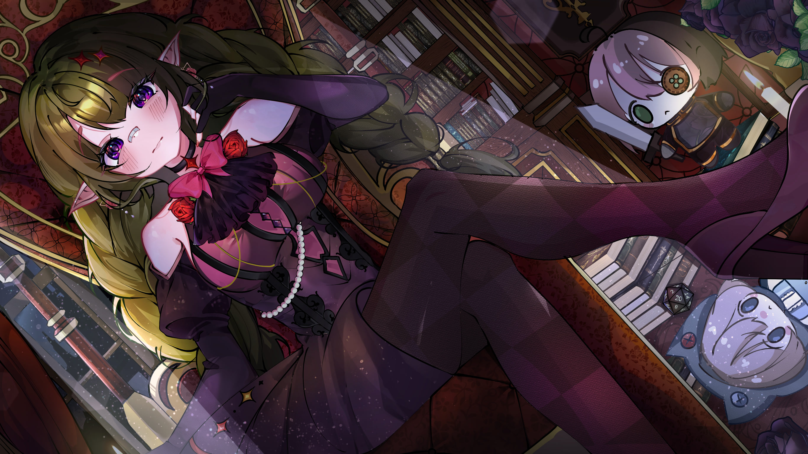
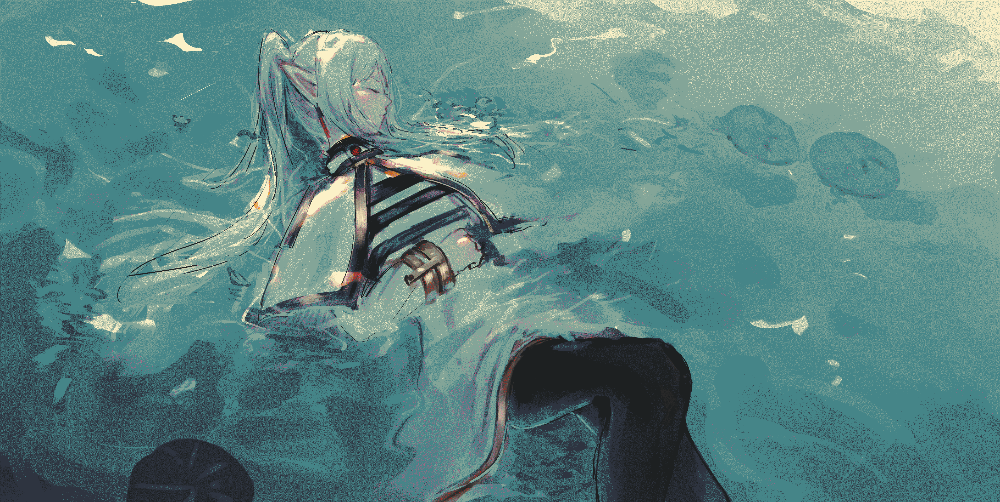
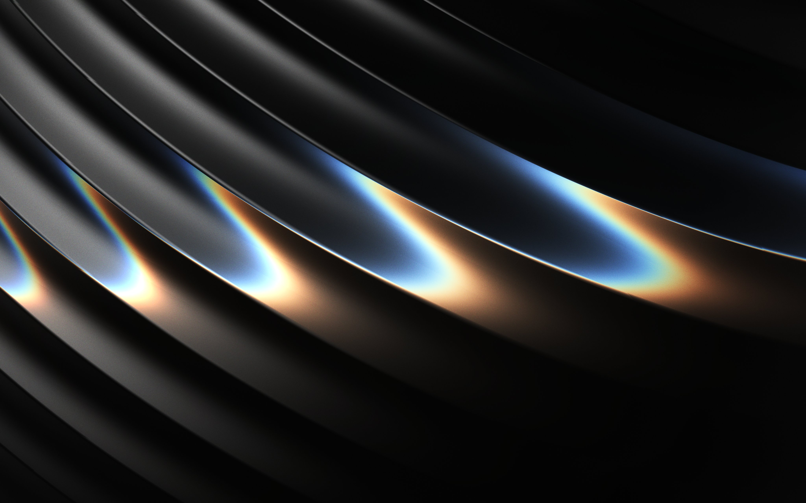

# Instalación manual de wallpapers
Una forma de clonar y mover las imagenes con solo un script.

## Forma de Instalación
Clonar repositorio y instalar
´´´
git clone https://github.com/Mapachuelo/Wallpaper.git
cd Wallpaper 
./install.sh
´´´
## Vista de los wallapers
<table>
  <tr>
    <td align="center"> 1004017-colorized</td>
    <td align="center"> 1107810-1</td>
    <td align="center"> 1137037</td>
    <td align="center"> 1254948</td>
  </tr>
  <tr>
    <td align="center"> 1289802</td>
    <td align="center"> 1369354</td>
    <td align="center"> 1396073</td>
    <td align="center"> 119259700_p0</td>
  </tr>
  <tr>
    <td align="center"> 119259700_p1</td>
    <td align="center"> 132150263_p0</td>
    <td align="center"> 138032536_p0</td>
    <td align="center"> 139396752_p0</td>
  </tr>
  <tr>
    <td align="center"> Girl Flowers</td>
    <td align="center"> Woman Birds</td>
    <td align="center"> Amplui</td>
    <td align="center"> Angel1</td>
  </tr>
  <tr>
    <td align="center"> Ardelia2</td>
    <td align="center"> aWmwTh</td>
    <td align="center"> Castorice</td>
    <td align="center"> Mainshot</td>
  </tr>
  <tr>
    <td align="center"> Ferineon</td>
    <td align="center"> Frieren Gruvbox</td>
    <td align="center"> Frieren Funeral</td>
    <td align="center"> Frieren Blue</td>
  </tr>
  <tr>
    <td align="center"> Frieren Night</td>
    <td align="center"> Frieren Rain</td>
    <td align="center"> Frieren Ring</td>
    <td align="center"> Frieren Kiss</td>
  </tr>
  <tr>
    <td align="center"> Frieren Sunset</td>
    <td align="center"> Frieren Underwater</td>
    <td align="center"> G5uBmit</td>
    <td align="center"> Garden Kita</td>
  </tr>
</table>
